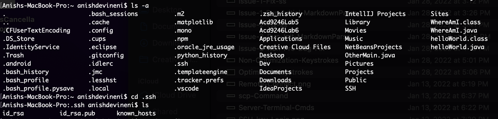
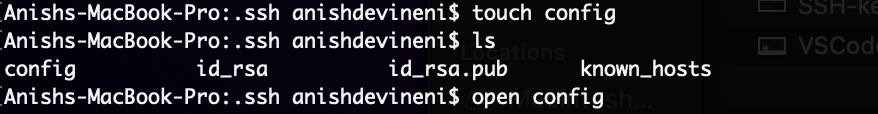

# Lab Report 3

## Group Choice 1 - Streamlining ssh Configuration

Logging into a remote server using ssh can require a quite lengthy command, shown below, that can take up too much time and can be a pain to type out completely every time you repeat this process. 

 > $ ssh cs15lwi22apg@ieng6.ucsd.edu

 In order to make this process shorter, I was able to streamline the ssh Configuration to make a shorter, handy code that will allow me to log in much more efficiently.

 To begin this process, I first opened up the terminal and located the .ssh folder in my personal computer.

 

After locating this directory, I used the command `touch config` to create a file named config through the integrated terminal, and I then utilized the command `open config` to open this file I had just created.

This command opened up a text editor, where I was able to change the contents of the config file to make it easier for me to log in to the remote server.

The contents I added to config in the picture above specify the Host name I am able to log in with, which in this case is ieng6, as well as the specific user I am looking to log in using. After saving this file, I made my way back to the terminal to see if these changes were effective. If this was successful, the only command I would have to type to log in to the remote ieng6 server would be `ssh ieng6`.

As seen in the picture, this command works, and successfuly logs in to the remote server with a much faster and easier command.

This makes running other commands much faster and more efficientas well. For example, if I have a java file that I want to move to the remote server from my computer using the `scp` command, I can do this by using the alias I have created, as shown below.

As you can see, I only had to type the command using my alias:

 > $ scp LabReport3.java ieng6:~/

 as opposed to what I would have had to type previously:

  > $ scp LabReport3.java cs15lwi22apg@ieng6.ucsd.edu:~/

  After I logged back into the remote server, it is clear that the command worked successfully.