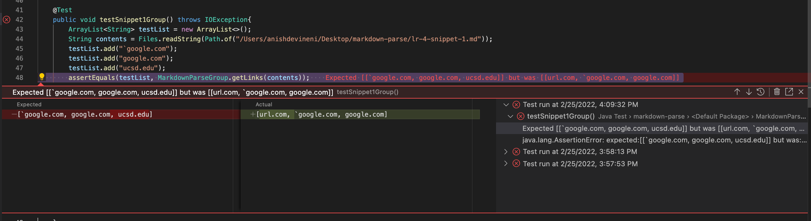

# Lab Report 4

## Code Snippet 1

The first code snippet produces the following output in the VSCode preview:

From this preview, it is apparent that the last three are valid links, while the first is not. Therefore, the expected output from the markdown parser should be:

``[`google.com, google.com, ucsd.edu]``

 

In order to test for this expected output, I created the following JUnit test:

For my implementation of MarkdownParse.java, the JUnit test failed with the following output:

The implementation of the group we reviewed also failed ther tests with the following output:

## Snippet 1 Fix

I do believe that there is a small code change that could make the program work for snippet 1 and all related cases that use inline code with backticks. This solution includes creating a variable that contains the index of the first backtick the parser encounters, as well as the index of the second backtick it encounters, following the first. If any brackets are contained in between these backticks, they should not be considered valid and should be skipped over. This could be accomplished by wrapping the bracket index declarations in a few if statements to check if they are in between any backticks, and not considering them as valid if they are.

 

---
 

## Code Snippet 2

The second code snippet produces the following output in the VSCode preview:

From this preview, it is apparent that there are 3 valid links in total. Therefore, the expected output from the markdown parser should be:

`[a.com, a.com, example.com]`

 

In order to test for this expected output, I created the following JUnit test:

For my implementation of MarkdownParse.java, the JUnit test failed with the following output:

The implementation of the group we reviewed also failed ther tests with the following output:

## Snippet 2 Fix

I don't believe that the change required to make the MarkdownParse program work for this markdown snippet would be small, or within 10 lines of code. The solution would entail fixing two problems, as the issue we see with the second link would require some sort of counter that checks to see if there is another open parenthesis it encounters, and when it closes, if at all. The issue with the third link could be fixed by just finding the index of any backslashes and not counting any brackets within the backslashes as valid. These two fixes would likely take a bit longer than 10 lines of code.

 

---
 

## Code Snippet 3

The second code snippet produces the following output in the VSCode preview:

From this preview, we can tell that there are 3 valid links in total, which are the ones that appear in blue. The rest should not be considered valid links. Therefore, the expected output from the markdown parser should be:

`[https://www.twitter.com, https://ucsd-cse15l-w22.github.io/, https://cse.ucsd.edu/]`

 

In order to test for this expected output, I created the following JUnit test:

For my implementation of MarkdownParse.java, the JUnit test failed with the following output:

The implementation of the group we reviewed also failed ther tests with the following output:

## Snippet 3 Fix

I do believe that there is a small code change that could be made to the MarkdownParse program that would make it work for snippet 3. The issue in this snippet stems from the extra spaces within the parentheses in the links, which causes the formatting for the output string to be thrown off. In order to fix this, I would implement some kind of while loop that iterates through the characters within the text between the parentheses and only starts and ends the substring where there are no spaces. This would result in only the text of the link being added to the output string, rather than all the extra space characters.